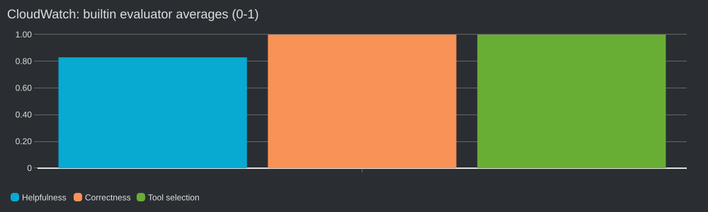
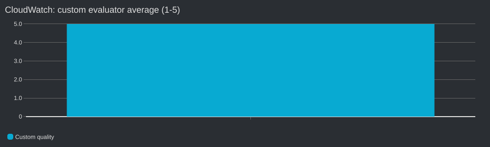

# 可视化示例

`dashboard.example.json` 由 `scripts/dashboard.py` 的同一组图表定义生成。实验执行者将账号、service、配置、日志组和 custom evaluator 名称替换为占位符；本文件用于审阅页面结构。管理员应使用真实 state 运行脚本创建 Dashboard，不能直接部署这些占位符。

下方 PNG 由 CloudWatch 图片 API 根据本次真实指标生成。实验执行者为图例使用匿名名称，图片不包含账号、配置 ID 或资源 ARN。图片展示指定历史窗口的均值，是静态指标预览；AWS Dashboard 本身还包含实时查询、数字卡片与趋势图。图片 API 的中文字体有限，因此这些预览使用英文标题，Dashboard 使用中文标题。

CloudWatch 对两个样本计算 Helpfulness=0.83、Correctness=1.0；工具选择评分有四个样本，均值1.0；custom 有两个样本，均值5.0。实验执行者没有将不同尺度的指标合成为总分。
